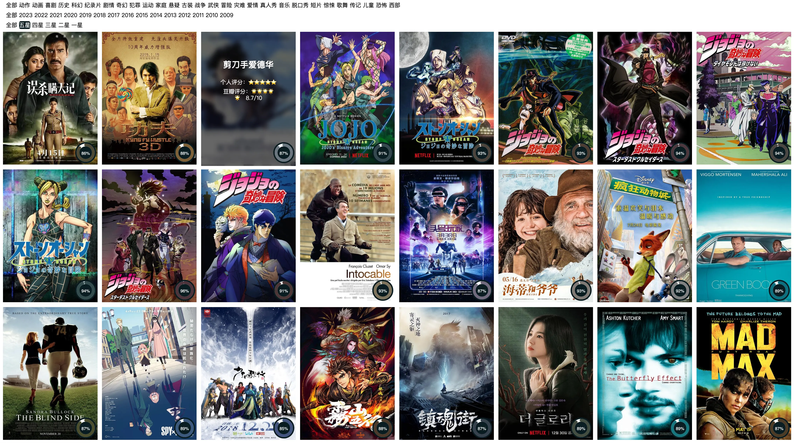

# 豆瓣已看电影展示

- 数据：使用了[豆瓣书影音同步 GitHub Action](https://imnerd.org/doumark.html)来抓取的`JSON`数据
- 页面自己写的，用的`Flex`布局+`jQuery`（处理数据和页面）

## 页面内容

1. 豆瓣影视图片
2. 影视题目
3. 影视个人评分
4. 豆瓣评分
5. 筛选条件(20230606)

## 预览界面




## 问题集锦

### 解决豆瓣图片不显示的问题

```
访问 img9.doubanio.com 的请求遭到拒绝
您未获授权，无法查看此网页。
HTTP ERROR 403
```

1. 将JSON文件下载到本地直接在本地加载即可
2. 使用的是根目录下的 `douban.py`(已支持Json movie文件、CSV movie、book文件) 下载到 `images/douban` 路径下
3. 页面路径怎样修改：看 `index.html` 第 **481** 行
4. 在 `.github/workflows` 创建了 `download.yml` 来监听 JSON 文件的变化从而自动下载图片并提交